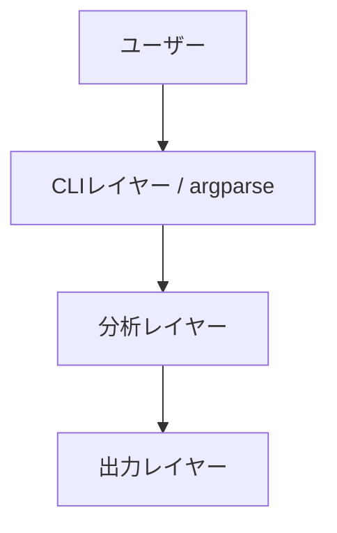
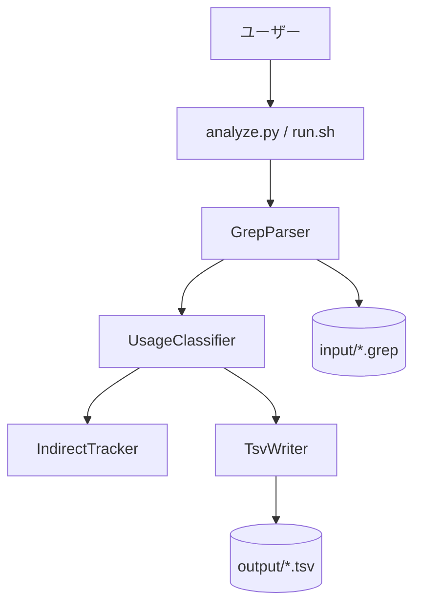
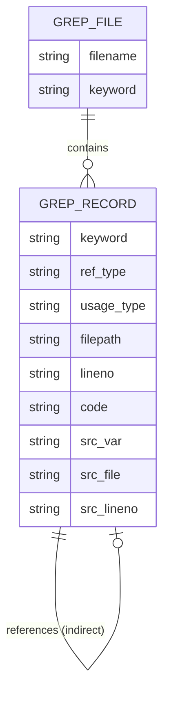
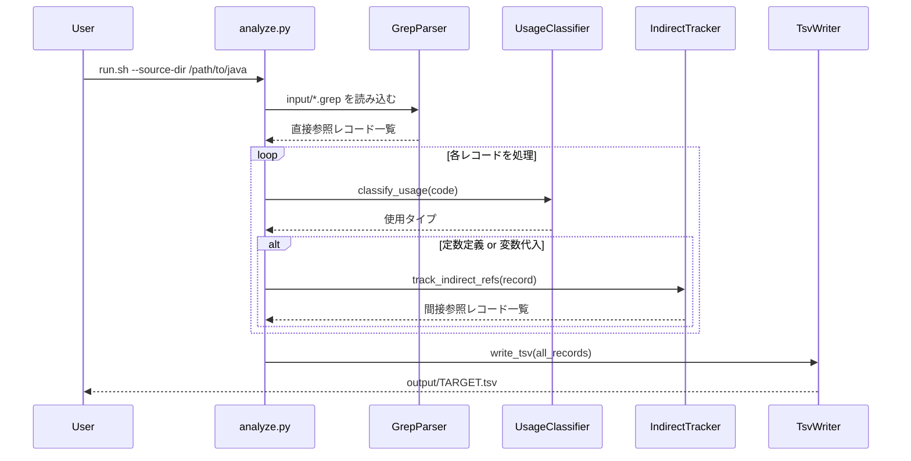

# 機能設計書作成ガイド

このガイドは、プロダクト要求定義書(PRD)に基づいて機能設計書を作成するための実践的な指針を提供します。

## 機能設計書の目的

機能設計書は、PRDで定義された「何を作るか」を「どう実現するか」に落とし込むドキュメントです。

**主な内容**:
- システム構成図
- データモデル
- コンポーネント設計
- アルゴリズム設計（該当する場合）
- CLI設計
- エラーハンドリング

## 作成の基本フロー

### ステップ1: PRDの確認

機能設計書を作成する前に、必ずPRDを確認します。

```
Claude CodeにPRDから機能設計書を作成してもらう際のプロンプト例:

PRDの内容に基づいて機能設計書を作成してください。
特に優先度P0(MVP)の機能に焦点を当ててください。
```

### ステップ2: システム構成図の作成

#### Mermaid記法の使用

システム構成図はMermaid記法で記述します。

**基本的な3層アーキテクチャの例**:


**より詳細な例**:


### ステップ3: データモデル定義

#### Pythonデータクラスで明確に

データモデルはPythonのdataclassとenumで定義します。

**基本的なGrepRecord型の例**:
```python
from dataclasses import dataclass, field
from enum import Enum

class RefType(Enum):
    DIRECT = "直接"
    INDIRECT = "間接"
    GETTER = "間接（getter経由）"

class UsageType(Enum):
    ANNOTATION = "アノテーション"
    CONSTANT = "定数定義"
    VARIABLE = "変数代入"
    CONDITION = "条件判定"
    RETURN = "return文"
    ARGUMENT = "メソッド引数"
    OTHER = "その他"

@dataclass(frozen=True)
class GrepRecord:
    keyword: str           # 検索した文言（入力ファイル名から取得）
    ref_type: RefType      # 参照種別
    usage_type: UsageType  # 使用タイプ（7種）
    filepath: str          # 該当行のファイルパス
    lineno: str            # 該当行の行番号
    code: str              # 該当行のコード（前後の空白はtrim）
    src_var: str = ""      # 間接参照の場合：経由した変数/定数名
    src_file: str = ""     # 間接参照の場合：変数/定数が定義されたファイルパス
    src_lineno: str = ""   # 間接参照の場合：変数/定数が定義された行番号
```

**重要なポイント**:
- 各フィールドにコメントで説明を追加
- `frozen=True` でイミュータブルにする
- `Enum` で取りうる値を明確に定義
- 間接参照専用フィールドはデフォルト値を設定

#### ER図の作成

複数のエンティティがある場合、ER図で関連を示します。



### ステップ4: コンポーネント設計

各レイヤーの責務を明確にします。

#### 入力レイヤー（CLIパース・grep結果読み込み）

**責務**: CLI引数のパース、grepファイルの読み込み・パース

```python
# CLIパーサー
def parse_args() -> argparse.Namespace:
    """CLI引数を解析する。"""
    ...

# grepファイルパーサー
def parse_grep_line(line: str) -> dict | None:
    """grep結果の1行をパースする。不正行はNoneを返す。"""
    ...

def process_grep_file(path: Path, keyword: str) -> list[GrepRecord]:
    """grepファイル全行を処理し、直接参照レコードのリストを返す。"""
    ...
```

#### 分析レイヤー

**責務**: AST解析による使用タイプ分類、間接参照の追跡

```python
# 使用タイプ分類
def classify_usage_ast(code: str, filepath: str, lineno: int, source_dir: Path) -> str:
    """javalangによるAST解析で使用タイプを分類する。"""
    ...

def classify_usage_regex(code: str) -> str:
    """正規表現フォールバックで使用タイプを分類する。"""
    ...

# 間接参照追跡
def track_indirect_refs(
    direct_record: GrepRecord, source_dir: Path
) -> list[GrepRecord]:
    """定数/変数の間接参照をスコープに応じて追跡する。"""
    ...
```

#### 出力レイヤー

**責務**: TSVへの書き出し、処理レポートの生成

```python
# TSV出力
def write_tsv(records: list[GrepRecord], output_path: Path) -> None:
    """GrepRecordのリストをUTF-8 BOM付きTSVに出力する。"""
    ...

# 処理レポート
def print_report(stats: ProcessStats) -> None:
    """処理サマリを標準出力に出力する。"""
    ...
```

### ステップ5: アルゴリズム設計（該当する場合）

複雑なロジック（例: 使用タイプの分類）は詳細に設計します。

#### 使用タイプ分類アルゴリズムの例

**目的**: Javaコード行から使用タイプ（7種）を判定

**判定ロジック（優先度順）**:

##### ステップ1: javalangでASTパース

```python
def classify_with_ast(code: str, tree: object) -> str | None:
    """ASTノードを走査し、使用タイプを返す。失敗時はNone。"""
    # AST走査でアノテーション/定数定義/変数代入/条件判定/return文/メソッド引数を検出
    ...
```

##### ステップ2: 正規表現フォールバック

```python
import re
from typing import TypeAlias

Pattern: TypeAlias = re.Pattern[str]

PATTERNS: list[tuple[Pattern, str]] = [
    (re.compile(r'@\w+\s*\('), "アノテーション"),
    (re.compile(r'\bstatic\s+final\b'), "定数定義"),
    (re.compile(r'\bif\s*\(|\bwhile\s*\(|\.equals\s*\('), "条件判定"),
    (re.compile(r'\breturn\b'), "return文"),
    (re.compile(r'\b\w+\s+\w+\s*='), "変数代入"),
    (re.compile(r'\w+\s*\('), "メソッド引数"),
]

def classify_with_regex(code: str) -> str:
    """正規表現で使用タイプを分類する（フォールバック）。"""
    stripped = code.strip()
    for pattern, usage_type in PATTERNS:
        if pattern.search(stripped):
            return usage_type
    return "その他"
```

##### ステップ3: 間接参照の追跡スコープ判定

```python
def determine_tracking_scope(usage_type: str, code: str) -> str:
    """変数の種類に応じて追跡スコープを返す。"""
    if usage_type == "定数定義":
        return "project"   # static final → プロジェクト全体
    if "フィールド" in code:
        return "class"     # インスタンス変数 → 同一クラス内 + getter
    return "method"        # ローカル変数 → 同一メソッド内
```

### ステップ6: ユースケース図

主要なユースケースをシーケンス図で表現します。

**grep結果分析のフロー**:


### ステップ7: CLI設計

CLIツールの場合、コマンド仕様を定義します。

```bash
# 基本的な使い方
run.sh --source-dir /path/to/javaproject

# オプション指定
run.sh --source-dir /path/to/javaproject \
       --input-dir /path/to/input \
       --output-dir /path/to/output \
       --help
```

| オプション | 必須 | デフォルト | 説明 |
|---|---|---|---|
| `--source-dir` | ✅ | - | Javaソースコードのルートディレクトリ |
| `--input-dir` | - | `input/` | grep結果ファイルの配置ディレクトリ |
| `--output-dir` | - | `output/` | TSV出力先ディレクトリ |
| `--help` | - | - | 使い方を表示して終了 |

### ステップ8: ファイル構造（該当する場合）

データの入出力形式を定義します。

**入力ファイル（grep結果）**:
```
input/
└── TARGET.grep     # grep -rn "TARGET" /path/to/java の出力
```

**grep結果フォーマット**:
```
src/main/java/Constants.java:10:    public static final String CODE = "TARGET";
src/main/java/Service.java:30:    if (x.equals("TARGET")) {
```

**出力ファイル（TSV）**:
```
output/
└── TARGET.tsv      # UTF-8 BOM付きTSV
```

**TSVフォーマット（ヘッダー）**:
```
文言	参照種別	使用タイプ	ファイルパス	行番号	コード行	参照元変数名	参照元ファイル	参照元行番号
```

### ステップ9: エラーハンドリング

エラーの種類と処理方法を定義します。

| エラー種別 | 処理 | ユーザーへの表示 |
|-----------|------|-----------------|
| `--source-dir` 未指定 | exit code 1 | "エラー: --source-dir は必須です" (stderr) |
| `input/` が空 | exit code 1 | "エラー: input/ ディレクトリにgrep結果ファイルがありません" (stderr) |
| バイナリ通知行 | スキップ・カウント | 処理完了後のサマリに記録 |
| ASTパースエラー | 正規表現フォールバック | 処理完了後のサマリに記録 |
| エンコーディングエラー | errors='replace' で継続 | 処理完了後のサマリに記録 |
| 予期しない例外 | exit code 2 | "予期しないエラー: [詳細]" (stderr) |

## 機能設計書のレビュー

### レビュー観点

Claude Codeにレビューを依頼します:

```
この機能設計書を評価してください。以下の観点で確認してください:

1. PRDの要件を満たしているか
2. データモデルは具体的か（型ヒント付きdataclassで定義されているか）
3. コンポーネントの責務は明確か
4. アルゴリズムは実装可能なレベルまで詳細化されているか
5. エラーハンドリングは網羅されているか
```

### 改善の実施

Claude Codeの指摘に基づいて改善します。

## まとめ

機能設計書作成の成功のポイント:

1. **PRDとの整合性**: PRDで定義された要件を正確に反映
2. **Mermaid記法の活用**: 図表で視覚的に表現
3. **Pythonデータクラス定義**: データモデルを型ヒント付きで明確に
4. **詳細なアルゴリズム設計**: 複雑なロジックは具体的に
5. **レイヤー分離**: 各コンポーネントの責務を明確に
6. **実装可能なレベル**: 開発者が迷わず実装できる詳細度
