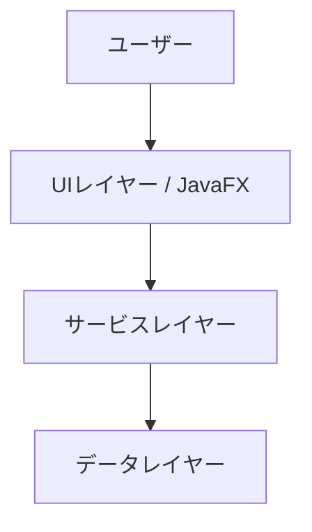
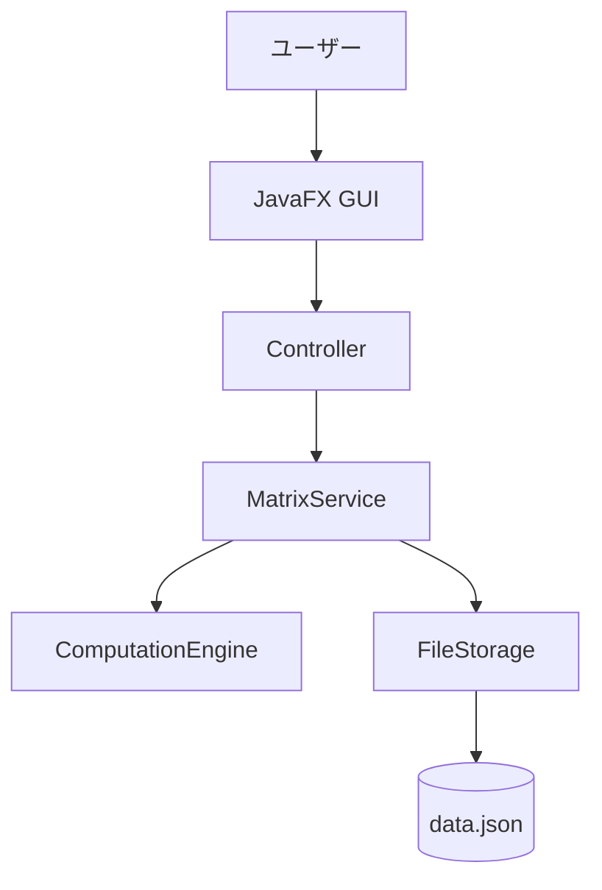
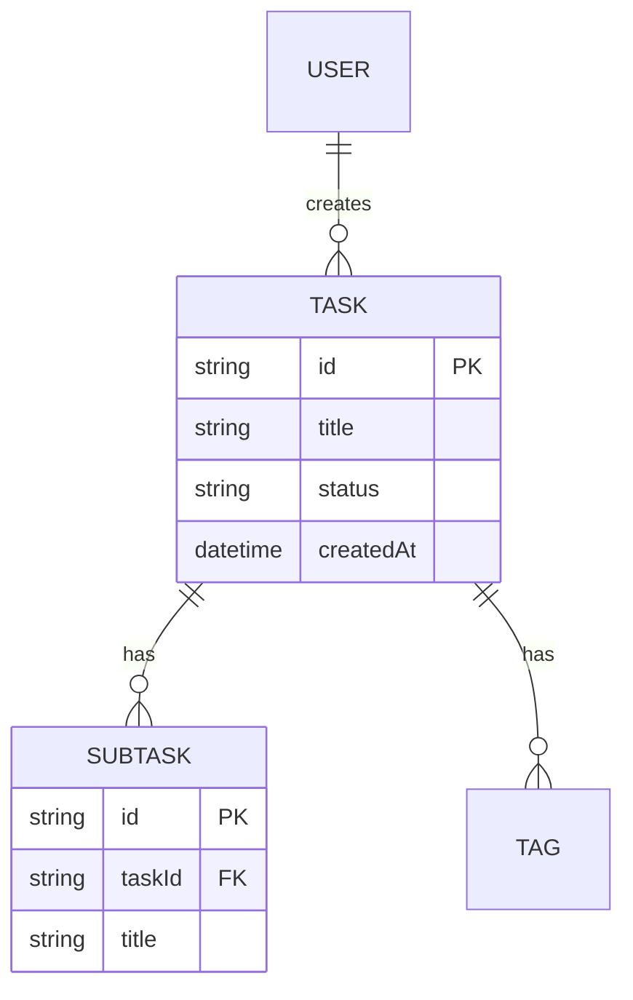
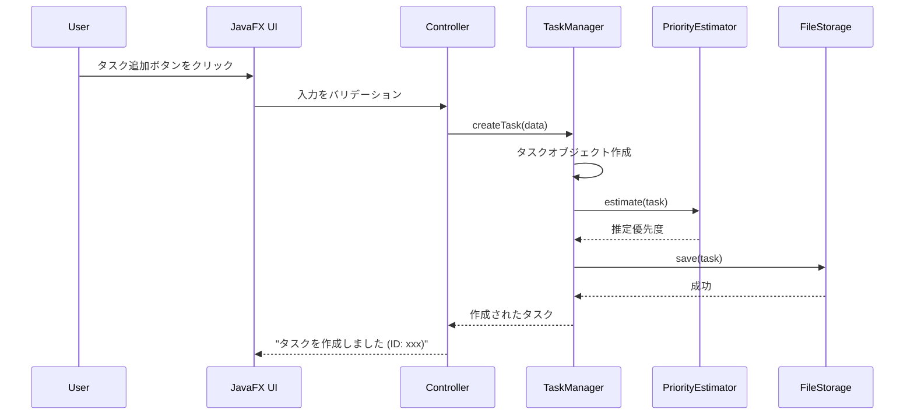

# 機能設計書作成ガイド

このガイドは、プロダクト要求定義書(PRD)に基づいて機能設計書を作成するための実践的な指針を提供します。

## 機能設計書の目的

機能設計書は、PRDで定義された「何を作るか」を「どう実現するか」に落とし込むドキュメントです。

**主な内容**:
- システム構成図
- データモデル
- コンポーネント設計
- アルゴリズム設計（該当する場合）
- UI設計
- エラーハンドリング

## 作成の基本フロー

### ステップ1: PRDの確認

機能設計書を作成する前に、必ずPRDを確認します。

```
Claude CodeにPRDから機能設計書を作成してもらう際のプロンプト例:

PRDの内容に基づいて機能設計書を作成してください。
特に優先度P0(MVP)の機能に焦点を当ててください。
```

### ステップ2: システム構成図の作成

#### Mermaid記法の使用

システム構成図はMermaid記法で記述します。

**基本的な3層アーキテクチャの例**:


**より詳細な例**:


### ステップ3: データモデル定義

#### Javaクラス定義で明確に

データモデルはJavaのクラスとenumで定義します。

**基本的なTask型の例**:
```java
public class Task {
    private String id;                        // UUID v4
    private String title;                     // 1-200文字
    private String description;               // オプション、Markdown形式
    private TaskStatus status;                // TODO, IN_PROGRESS, COMPLETED
    private TaskPriority priority;            // HIGH, MEDIUM, LOW
    private TaskPriority estimatedPriority;   // 自動推定された優先度
    private LocalDateTime dueDate;            // 期限
    private LocalDateTime createdAt;          // 作成日時
    private LocalDateTime updatedAt;          // 更新日時
    private List<StatusChange> statusHistory; // ステータス変更履歴

    // コンストラクタ、getter、setter
}

public enum TaskStatus {
    TODO,
    IN_PROGRESS,
    COMPLETED
}

public enum TaskPriority {
    HIGH,
    MEDIUM,
    LOW
}

public class StatusChange {
    private TaskStatus from;
    private TaskStatus to;
    private LocalDateTime changedAt;

    // コンストラクタ、getter
}
```

**重要なポイント**:
- 各フィールドにコメントで説明を追加
- 制約（文字数、形式など）を明記
- オプションフィールドにはnull許容であることを明示（またはOptionalを使用）
- enumで取りうる値を明確に定義

#### ER図の作成

複数のエンティティがある場合、ER図で関連を示します。



### ステップ4: コンポーネント設計

各レイヤーの責務を明確にします。

#### UIレイヤー（JavaFX）

**責務**: ユーザー入力の受付、バリデーション、結果の表示

```java
// JavaFX Controller
public class MainController {
    // ユーザー入力を受け付ける
    public Command parseInput();

    // 結果を表示する
    public void displayResult(Result result);

    // エラーを表示する
    public void displayError(Exception error);
}
```

#### サービスレイヤー

**責務**: ビジネスロジックの実装

```java
// TaskManager
public class TaskManager {
    // タスクを作成する
    public Task createTask(CreateTaskData data);

    // タスク一覧を取得する
    public List<Task> listTasks(FilterOptions filter);

    // タスクを更新する
    public Task updateTask(String id, UpdateTaskData data);

    // タスクを削除する
    public void deleteTask(String id);
}
```

#### データレイヤー

**責務**: データの永続化と取得

```java
// FileStorage（ジェネリクスで型安全に）
public class FileStorage<T> {
    // データを保存する
    public void save(T data);

    // データを読み込む
    public T load();

    // ファイルが存在するか確認する
    public boolean exists();
}
```

### ステップ5: アルゴリズム設計（該当する場合）

複雑なロジック（例: 優先度自動推定）は詳細に設計します。

#### 優先度自動推定アルゴリズムの例

**目的**: タスクの期限、作成日時、ステータスから優先度を自動推定

**計算ロジック**:

##### ステップ1: 期限スコア計算（0-100点）
```
- 期限超過: 100点（最高）
- 期限まで0-3日: 90点
- 期限まで4-7日: 70点
- 期限まで8-14日: 50点
- 期限まで14日以上: 30点
- 期限設定なし: 20点
```

**計算式**:
```java
public int calculateDeadlineScore(LocalDateTime dueDate) {
    if (dueDate == null) return 20;

    LocalDateTime now = LocalDateTime.now();
    long daysRemaining = ChronoUnit.DAYS.between(now, dueDate);

    if (daysRemaining < 0) return 100;  // 期限超過
    if (daysRemaining <= 3) return 90;
    if (daysRemaining <= 7) return 70;
    if (daysRemaining <= 14) return 50;
    return 30;
}
```

##### ステップ2: 経過時間スコア計算（0-100点）
```
- 作成から30日以上: 100点（最高）
- 作成から21-30日: 80点
- 作成から14-21日: 60点
- 作成から7-14日: 40点
- 作成から7日未満: 20点
```

**計算式**:
```java
public int calculateAgeScore(LocalDateTime createdAt) {
    LocalDateTime now = LocalDateTime.now();
    long daysOld = ChronoUnit.DAYS.between(createdAt, now);

    if (daysOld >= 30) return 100;
    if (daysOld >= 21) return 80;
    if (daysOld >= 14) return 60;
    if (daysOld >= 7) return 40;
    return 20;
}
```

##### ステップ3: ステータススコア計算（0-100点）
```
- 進行中 (IN_PROGRESS): 100点（最高優先）
- 未着手 (TODO): 50点
- 完了 (COMPLETED): 0点
```

**計算式**:
```java
public int calculateStatusScore(TaskStatus status) {
    switch (status) {
        case IN_PROGRESS: return 100;
        case TODO:         return 50;
        case COMPLETED:    return 0;
        default:           return 0;
    }
}
```

##### ステップ4: 総合スコア計算

**加重平均**:
```
総合スコア = (期限スコア × 50%) + (経過時間スコア × 20%) + (ステータススコア × 30%)
```

**計算式**:
```java
public double calculateTotalScore(Task task) {
    int deadlineScore = calculateDeadlineScore(task.getDueDate());
    int ageScore = calculateAgeScore(task.getCreatedAt());
    int statusScore = calculateStatusScore(task.getStatus());

    return (deadlineScore * 0.5) + (ageScore * 0.2) + (statusScore * 0.3);
}
```

##### ステップ5: 優先度分類

**閾値による分類**:
```
- 70点以上: HIGH（高優先度）
- 40-70点: MEDIUM（中優先度）
- 40点未満: LOW（低優先度）
```

**計算式**:
```java
public TaskPriority estimatePriority(Task task) {
    double score = calculateTotalScore(task);

    if (score >= 70) return TaskPriority.HIGH;
    if (score >= 40) return TaskPriority.MEDIUM;
    return TaskPriority.LOW;
}
```

**完全な実装例**:
```java
public class PriorityEstimator {

    public TaskPriority estimate(Task task) {
        int deadlineScore = calculateDeadlineScore(task.getDueDate());
        int ageScore = calculateAgeScore(task.getCreatedAt());
        int statusScore = calculateStatusScore(task.getStatus());

        double totalScore = (deadlineScore * 0.5) + (ageScore * 0.2) + (statusScore * 0.3);

        if (totalScore >= 70) return TaskPriority.HIGH;
        if (totalScore >= 40) return TaskPriority.MEDIUM;
        return TaskPriority.LOW;
    }

    private int calculateDeadlineScore(LocalDateTime dueDate) {
        if (dueDate == null) return 20;

        LocalDateTime now = LocalDateTime.now();
        long daysRemaining = ChronoUnit.DAYS.between(now, dueDate);

        if (daysRemaining < 0) return 100;
        if (daysRemaining <= 3) return 90;
        if (daysRemaining <= 7) return 70;
        if (daysRemaining <= 14) return 50;
        return 30;
    }

    private int calculateAgeScore(LocalDateTime createdAt) {
        LocalDateTime now = LocalDateTime.now();
        long daysOld = ChronoUnit.DAYS.between(createdAt, now);

        if (daysOld >= 30) return 100;
        if (daysOld >= 21) return 80;
        if (daysOld >= 14) return 60;
        if (daysOld >= 7) return 40;
        return 20;
    }

    private int calculateStatusScore(TaskStatus status) {
        switch (status) {
            case IN_PROGRESS: return 100;
            case TODO:         return 50;
            case COMPLETED:    return 0;
            default:           return 0;
        }
    }
}
```

### ステップ6: ユースケース図

主要なユースケースをシーケンス図で表現します。

**タスク追加のフロー**:


### ステップ7: UI設計（該当する場合）

JavaFXアプリの場合、TableView表示やスタイリングを定義します。

#### テーブル表示

```
┌──────────┬──────────────────┬────────────┬──────────┬───────────────┐
│ ID       │ タイトル          │ ステータス   │ 優先度    │ 期限           │
├──────────┼──────────────────┼────────────┼──────────┼───────────────┤
│ 7a5c6ff0 │ 牛乳を買って帰る.   │ 未着手      │ 高       │ 2025-11-05    │
│          │                  │            │          │ (あと1日)      │
└──────────┴──────────────────┴────────────┴──────────┴───────────────┘
```

#### カラーコーディング

**ステータスの色分け**:
- 完了 (COMPLETED): 緑
- 進行中 (IN_PROGRESS): 黄
- 未着手 (TODO): 白

**優先度の色分け**:
- 高 (HIGH): 赤
- 中 (MEDIUM): 黄
- 低 (LOW): 青

### ステップ8: ファイル構造（該当する場合）

データの保存形式を定義します。

**例: JavaFXアプリのデータ保存**:
```
.linalgpad/
├── data.json       # アプリケーションデータ
└── config.json     # 設定データ
```

**data.json の例**:
```json
{
  "tasks": [
    {
      "id": "7a5c6ff0-5f55-474e-baf7-ea13624d73a4",
      "title": "牛乳を買って帰る",
      "description": "",
      "status": "TODO",
      "priority": "HIGH",
      "estimatedPriority": "MEDIUM",
      "dueDate": "2025-11-05T00:00:00",
      "createdAt": "2025-11-04T10:00:00",
      "updatedAt": "2025-11-04T10:00:00"
    }
  ]
}
```

### ステップ9: エラーハンドリング

エラーの種類と処理方法を定義します。

| エラー種別 | 処理 | ユーザーへの表示 |
|-----------|------|-----------------|
| 入力検証エラー | 処理を中断、エラーメッセージ表示 | "タイトルは1-200文字で入力してください" |
| ファイル読み込みエラー | 空の初期データで継続 | "データファイルが見つかりません。新規作成します" |
| タスクが見つからない | 処理を中断、エラーメッセージ表示 | "タスクが見つかりません (ID: xxx)" |

## 機能設計書のレビュー

### レビュー観点

Claude Codeにレビューを依頼します:

```
この機能設計書を評価してください。以下の観点で確認してください:

1. PRDの要件を満たしているか
2. データモデルは具体的か
3. コンポーネントの責務は明確か
4. アルゴリズムは実装可能なレベルまで詳細化されているか
5. エラーハンドリングは網羅されているか
```

### 改善の実施

Claude Codeの指摘に基づいて改善します。

## まとめ

機能設計書作成の成功のポイント:

1. **PRDとの整合性**: PRDで定義された要件を正確に反映
2. **Mermaid記法の活用**: 図表で視覚的に表現
3. **Javaクラス/インターフェース定義**: データモデルを明確に
4. **詳細なアルゴリズム設計**: 複雑なロジックは具体的に
5. **レイヤー分離**: 各コンポーネントの責務を明確に
6. **実装可能なレベル**: 開発者が迷わず実装できる詳細度
