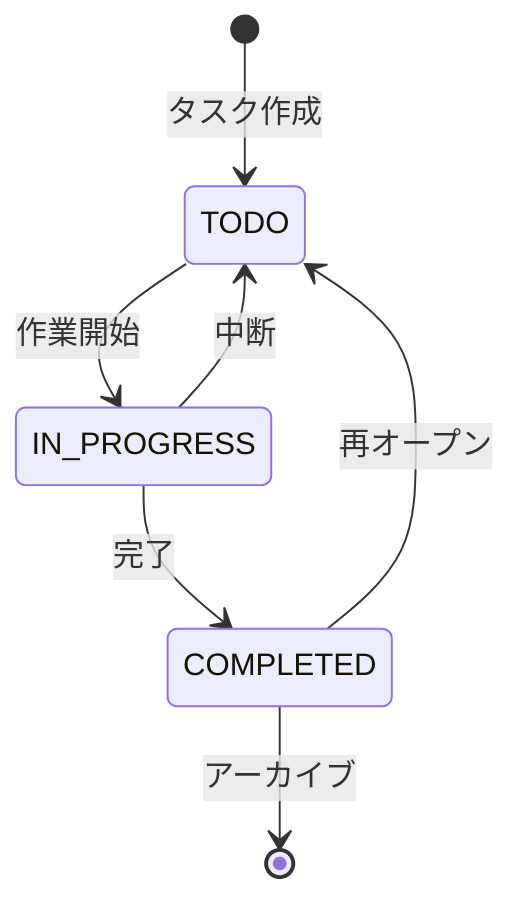

# 用語集作成ガイド

## 基本原則

### 1. 明確で一貫した定義

用語の定義は曖昧さを排除し、誰が読んでも同じ理解ができるようにします。

**悪い例**:
```markdown
## タスク
ユーザーがやるべきこと
```

**良い例**:
```markdown
## タスク (Task)
**定義**: ユーザーが完了すべき作業の単位。タイトル、説明、期限、
ステータス(未着手/進行中/完了)を持つ。

**関連用語**: サブタスク、タスクグループ

**使用例**:
- 「タスクを追加する」: 新しいタスクをシステムに登録する
- 「タスクを完了する」: タスクのステータスを完了に変更する

**データモデル**: `src/main/java/com/linalgpad/model/Task.java`
```

### 2. 具体例を含める

抽象的な定義だけでなく、具体的な使用例を示します。

**例**:
```markdown
## 優先度 (Priority)
**定義**: タスクの重要度と緊急度を示す3段階の指標

**値の定義**:
- `HIGH`: 緊急かつ重要。即座に対応が必要
- `MEDIUM`: 重要だが緊急ではない。計画的に対応
- `LOW`: 重要度・緊急度ともに低い。時間があれば対応

**判断基準**:
- HIGH: 期限が24時間以内、または他のタスクをブロック
- MEDIUM: 期限が1週間以内
- LOW: 期限が1週間以上先、または期限なし

**使用例**:
```java
Task task = new Task.Builder()
    .title("セキュリティ脆弱性の修正")
    .priority(Priority.HIGH) // 緊急対応が必要
    .build();
```
```

### 3. 関連用語をリンクする

用語同士の関係性を明確にします。

**例**:
```markdown
## タスク (Task)
**定義**: [定義]

**関連用語**:
- [サブタスク](#サブタスク): タスクを細分化したもの
- [タスクグループ](#タスクグループ): 複数のタスクをまとめたもの
- [ステータス](#タスクステータス): タスクの進行状態

**親子関係**:
- 親: タスクグループ
- 子: サブタスク
```

## 用語の分類方法

### ドメイン用語の定義

**対象**: プロジェクト固有のビジネス概念

**定義すべき項目**:
```markdown
## [用語]

**定義**: [1-2文での簡潔な定義]

**説明**: [詳細な説明、背景、制約]

**関連用語**: [関連する他の用語]

**使用例**: [具体的な使用シーン]

**データモデル**: [該当するファイルパス]

**英語表記**: [English term] (グローバル展開がある場合)
```

**例**:
```markdown
## ステアリングファイル (Steering File)

**定義**: 短期的なタスク管理のために作成される一時的なドキュメント

**説明**:
ステアリングファイルは `.steering/[YYYYMMDD]-[task-name]/` ディレクトリに
配置され、タスク完了後1-2週間で削除されます。タスクの仕様、実装メモ、
レビュー記録などを含みます。

**関連用語**:
- [永続ドキュメント](#永続ドキュメント): 長期保存されるドキュメント
- [タスクモード](#タスクモード): ステアリングファイルを使用する開発モード

**使用例**:
- 「機能追加のためにステアリングファイルを作成する」
- 「タスク完了後、ステアリングファイルを削除またはアーカイブする」

**ディレクトリ構造**:
```
.steering/
└── 20250101-add-priority-feature/
    ├── requirements.md      # 今回の作業の要求内容
    ├── design.md            # 変更内容の設計
    └── tasklist.md          # タスクリスト
```

**英語表記**: Steering File
```

### 技術用語の定義

**対象**: 使用している技術、フレームワーク、ツール

**定義すべき項目**:
```markdown
## [技術名]

**定義**: [技術の簡潔な説明]

**公式サイト**: [URL]

**本プロジェクトでの用途**: [どのように使用しているか]

**バージョン**: [使用バージョン]

**選定理由**: [なぜこの技術を選んだか]

**代替技術**: [検討した他の選択肢]

**関連ドキュメント**: [内部ドキュメントへのリンク]

**設定ファイル**: [設定ファイルのパス]
```

**例**:
```markdown
## Java

**定義**: 静的型付けのオブジェクト指向プログラミング言語。JVM上で動作する

**公式サイト**: https://dev.java/

**本プロジェクトでの用途**:
全てのソースコードをJavaで記述し、型安全性とクロスプラットフォーム動作を確保しています。

**バージョン**: 17+

**選定理由**:
- 強力な静的型付けによる大規模開発での保守性向上
- 豊富なエコシステムとライブラリ
- JavaFXによるデスクトップGUIの構築が可能
- コンパイル時のエラー検出

**代替技術**:
- Kotlin: JavaFXとの統合実績がJavaに比べて少ない
- Python (Tkinter/Qt): 型安全性に劣り、配布が複雑

**関連ドキュメント**:
- [アーキテクチャ設計書](./architecture.md#技術スタック)
- [開発ガイドライン](./development-guidelines.md#Javaコーディング規約)

**設定ファイル**: `build.gradle`
```

### 略語・頭字語の定義

**原則**:
- 正式名称を明記
- 初出時は略語と正式名称を併記
- プロジェクト固有の略語は避ける (一般的な略語のみ使用)

**例**:
```markdown
## GUI

**正式名称**: Graphical User Interface

**意味**: グラフィカルなユーザーインターフェース

**本プロジェクトでの使用**:
LinAlgPadツールのメインインターフェースとして使用。ユーザーは
JavaFXベースのGUI上で行列やベクトルの演算を視覚的に操作します。

**実装**: `src/main/java/com/linalgpad/ui/` ディレクトリ

**関連技術**: JavaFX

## TDD

**正式名称**: Test-Driven Development

**意味**: テスト駆動開発。テストを先に書いてから実装を行う開発手法

**本プロジェクトでの適用**:
全ての新機能開発でTDDを採用しています。

**手順**:
1. テストを書く
2. テストを実行 → 失敗を確認
3. 実装を書く
4. テストを実行 → 成功を確認
5. リファクタリング

**参考**: [開発ガイドライン](./development-guidelines.md#TDD)
```

### アーキテクチャ用語の定義

**対象**: システム設計・パターンに関する概念

**定義すべき項目**:
```markdown
## [概念]

**定義**: [アーキテクチャ概念の説明]

**本プロジェクトでの適用**: [具体的な実装方法]

**メリット**: [採用理由]

**デメリット**: [制約・トレードオフ]

**関連コンポーネント**: [関連するコンポーネント]

**図解**: [構造図]

**参考資料**: [参考文献やURL]
```

**例**:
```markdown
## レイヤードアーキテクチャ (Layered Architecture)

**定義**: システムを役割ごとに複数の層に分割し、上位層から下位層への
一方向の依存関係を持たせる設計パターン

**本プロジェクトでの適用**:
3層アーキテクチャを採用しています:

```
UIレイヤー (ui/)
    ↓
サービスレイヤー (service/)
    ↓
データレイヤー (repository/)
```

**各層の責務**:
- UIレイヤー: ユーザー入力の受付と表示 (JavaFX)
- サービスレイヤー: ビジネスロジックの実装
- データレイヤー: データの永続化と取得

**メリット**:
- 関心の分離による保守性向上
- テストが容易 (各層を独立してテスト可能)
- 変更の影響範囲が限定的

**デメリット**:
- 小規模プロジェクトでは過剰設計になる可能性
- レイヤー間のデータ変換でオーバーヘッド

**依存関係のルール**:
- UIレイヤー → サービスレイヤー (許可)
- サービスレイヤー → データレイヤー (許可)
- データレイヤー → サービスレイヤー (禁止)
- データレイヤー → UIレイヤー (禁止)

**実装箇所**: `src/main/java/com/linalgpad/` ディレクトリの構造に反映

**参考資料**:
- [アーキテクチャ設計書](./architecture.md)
- [リポジトリ構造定義書](./repository-structure.md)
```

## 状態遷移の定義

**対象**: エンティティのステータスや状態

**定義方法**:

1. **表形式で列挙**
2. **遷移条件を明記**
3. **Mermaid図で可視化**

**例**:
```markdown
## タスクステータス (Task Status)

**定義**: タスクの進行状態を示す列挙型

**取りうる値**:

| ステータス | 意味 | 遷移条件 | 次の状態 |
|----------|------|---------|---------|
| `TODO` | 未着手 | タスク作成時の初期状態 | `IN_PROGRESS` |
| `IN_PROGRESS` | 進行中 | ユーザーがタスクを開始 | `COMPLETED`, `TODO` |
| `COMPLETED` | 完了 | ユーザーがタスクを完了 | `TODO` (再オープン可能) |

**状態遷移図**:


**実装**:
```java
// src/main/java/com/linalgpad/model/TaskStatus.java
public enum TaskStatus {
    TODO, IN_PROGRESS, COMPLETED;

    /** この状態から指定した状態へ遷移可能かを判定する */
    public boolean canTransitionTo(TaskStatus target) {
        return switch (this) {
            case TODO -> target == IN_PROGRESS;
            case IN_PROGRESS -> target == COMPLETED || target == TODO;
            case COMPLETED -> target == TODO;
        };
    }
}
```

**ビジネスルール**:
- `TODO` → `COMPLETED` への直接遷移は禁止
- 完了したタスクは再オープン可能
- アーカイブされたタスクは変更不可
```

## エラー・例外の定義

**対象**: システムで定義されているエラークラス

**定義すべき項目**:
```markdown
## [エラー名]

**クラス名**: `[ExceptionClassName]`

**継承元**: `RuntimeException` または `[ParentException]`

**発生条件**: [どういう時に発生するか]

**エラーメッセージフォーマット**: [メッセージの形式]

**対処方法**:
- ユーザー: [ユーザーがすべきこと]
- 開発者: [開発者がすべきこと]

**エラーコード**: [該当する場合]

**ログレベル**: [ERROR, WARN, INFO]

**実装箇所**: [ファイルパス]

**使用例**: [コード例]
```

**例**:
```markdown
## バリデーションエラー (Validation Error)

**クラス名**: `ValidationException`

**継承元**: `RuntimeException`

**発生条件**:
ユーザー入力がビジネスルールに違反した場合に発生します。

**エラーメッセージフォーマット**:
```
[フィールド名]: [エラー内容]
```

**対処方法**:
- ユーザー: エラーメッセージに従って入力を修正
- 開発者: バリデーションロジックが正しいか確認

**エラーコード**: `VAL-XXX` (XXXは3桁の数値)

**ログレベル**: WARN (ユーザー起因のエラーのため)

**実装箇所**: `src/main/java/com/linalgpad/exception/ValidationException.java`

**使用例**:
```java
// 例外のスロー
if (title.isEmpty()) {
    throw new ValidationException(
        "タイトルは必須です",
        "title",
        title
    );
}

// 例外のハンドリング
try {
    taskService.create(data);
} catch (ValidationException e) {
    logger.warn("入力エラー: {}", e.getMessage());
    logger.warn("フィールド: {}", e.getField());
}
```

**関連するバリデーション**:
- タイトル: 1-200文字
- 期限: 現在時刻以降
- 優先度: HIGH, MEDIUM, LOW のいずれか
```

## 用語の保守・更新

### 用語追加のタイミング

**追加すべき時**:
- 新しい概念が導入された
- チームメンバーから質問があった用語
- ドキュメントで3回以上出現する用語
- 外部サービスやAPIを統合した時

**追加不要な時**:
- プログラミング一般の用語 (変数、関数など)
- 一度しか使わない一時的な用語

### 更新のワークフロー

1. **用語の追加・変更**
   - 適切なカテゴリに追加
   - 定義項目を全て埋める
   - 関連用語をリンク

2. **レビュー**
   - チームメンバーに共有
   - 定義の妥当性を確認

3. **変更履歴の記録**
   - 用語集の変更履歴テーブルを更新
   - コミットメッセージに記載

4. **影響範囲の確認**
   - 用語を使用している箇所を検索
   - 必要に応じてドキュメントを更新

### 索引の管理

**五十音順・アルファベット順に整理**:

```markdown
## 索引

### あ行
- [アーカイブ](#アーカイブ) - プロセス用語
- [エラーハンドリング](#エラーハンドリング) - 技術用語

### か行
- [カバレッジ](#カバレッジ) - 技術用語

### さ行
- [ステアリングファイル](#ステアリングファイル) - ドメイン用語
- [ステータス](#タスクステータス) - データモデル用語

### た行
- [タスク](#タスク) - ドメイン用語
- [TDD](#TDD) - 略語

### A-Z
- [GUI](#GUI) - 略語
- [Java](#Java) - 技術用語
```

## チェックリスト

- [ ] 全ての用語が明確に定義されている
- [ ] 具体例が含まれている
- [ ] 関連用語がリンクされている
- [ ] カテゴリが適切に分類されている
- [ ] 技術用語にバージョン情報がある
- [ ] 略語に正式名称が記載されている
- [ ] 状態遷移が図解されている
- [ ] エラーに対処方法が記載されている
- [ ] 索引が整理されている
- [ ] 変更履歴が記録されている
