# analyze.py 完全解剖ドキュメント

> **このドキュメントの目的**
> `docs/code-walkthrough.md` よりさらに深く、「なぜそうなっているか」「内部で何が起きているか」を
> 図解・具体例・シーケンス図を使って徹底解説する。
> 特に **「構文木（AST）とは何か」「何がインプットになるか」「何を探しているか」** を重点的に扱う。

---

## 目次

1. [システム全体像](#1-システム全体像)
2. [このツールが解く問題](#2-このツールが解く問題)
3. [ファイル構成とモジュール依存](#3-ファイル構成とモジュール依存)
4. [データモデル完全図](#4-データモデル完全図)
5. [処理フロー全体シーケンス](#5-処理フロー全体シーケンス)
6. [構文木（AST）完全ガイド ← ★本命★](#6-構文木ast完全ガイド)
   - 6-1. 構文木とは何か（概念）
   - 6-2. インプット：Javaソースファイルの全文テキスト
   - 6-3. javalang が生成する構文木の全量
   - 6-4. 構文木を走査して「何を探しているか」
   - 6-5. 各ノード型と判定ロジックの対応
7. [F-01 GrepParser：入力解析](#7-f-01-grepparser入力解析)
8. [F-02 UsageClassifier：使用タイプ分類](#8-f-02-usageclassifier使用タイプ分類)
9. [F-03 IndirectTracker：間接参照追跡](#9-f-03-indirecttracker間接参照追跡)
10. [F-04 GetterTracker：getter経由追跡](#10-f-04-gettertrackergetter経由追跡)
11. [F-05 TsvWriter：TSV出力](#11-f-05-tsvwritertsv出力)
12. [F-06 Reporter：サマリ表示](#12-f-06-reporterサマリ表示)
13. [ASTキャッシュ機構の詳細](#13-astキャッシュ機構の詳細)
14. [正規表現フォールバックの仕組み](#14-正規表現フォールバックの仕組み)
15. [スコープ判定の全パターン](#15-スコープ判定の全パターン)
16. [エラーハンドリング設計](#16-エラーハンドリング設計)
17. [テストフィクスチャで動作を追う完全トレース](#17-テストフィクスチャで動作を追う完全トレース)

---

## 1. システム全体像

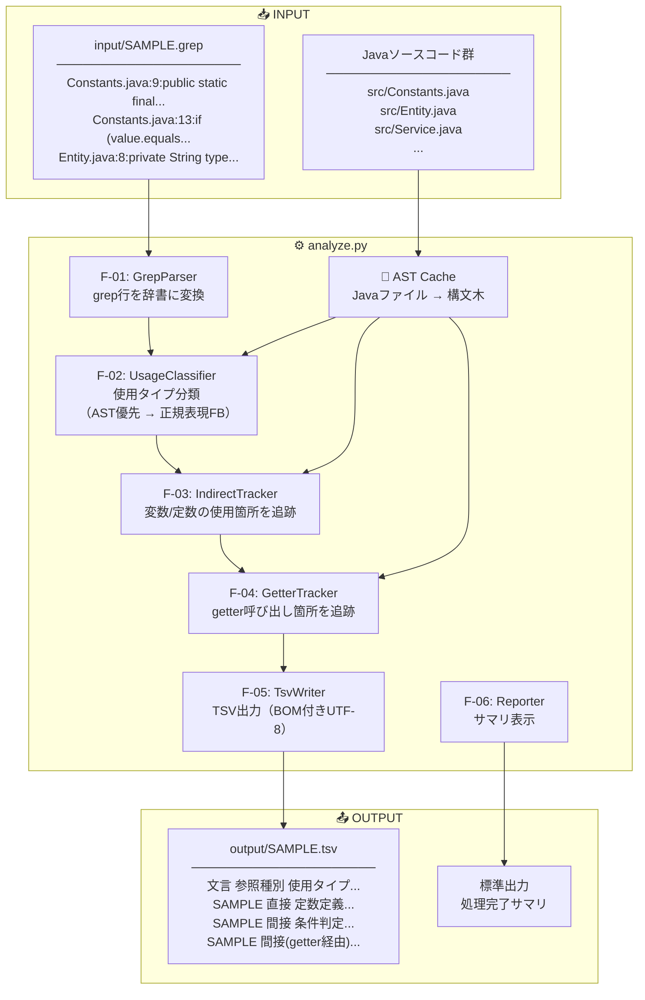

---

## 2. このツールが解く問題

### 問題の背景

Javaの大規模プロジェクトで、ある文字列（例：`"SAMPLE"`）が **どこで・どんな目的で** 使われているかを把握したい。

単純な `grep "SAMPLE" *.java` だと：
- 「定数として定義している行」なのか
- 「比較に使っている行」なのか
- 「ログに出力しているだけ」なのか

が区別できない。さらに：

```java
// Constants.java
public static final String CODE = "SAMPLE";  ← grepで直接ヒット

// Service.java
if (obj.getCode().equals("SAMPLE")) { ... }  ← grepでヒット

// Other.java
if (code.equals(CODE)) { ... }  ← "SAMPLE"は出てこないが実質的な参照！
```

`Other.java` の `CODE` は文字列として `"SAMPLE"` を含まないため grep でヒットしない。
しかし実態として `"SAMPLE"` への**間接的な参照**である。

### このツールの解決アプローチ

```
ステップ1: grepファイルの各行を分類（直接参照）
ステップ2: 「定数定義」「変数代入」の行から変数名を抽出
ステップ3: その変数名をプロジェクト内で再検索（間接参照の追跡）
ステップ4: フィールドなら対応するgetterも追跡（getter経由参照）
```

---

## 3. ファイル構成とモジュール依存

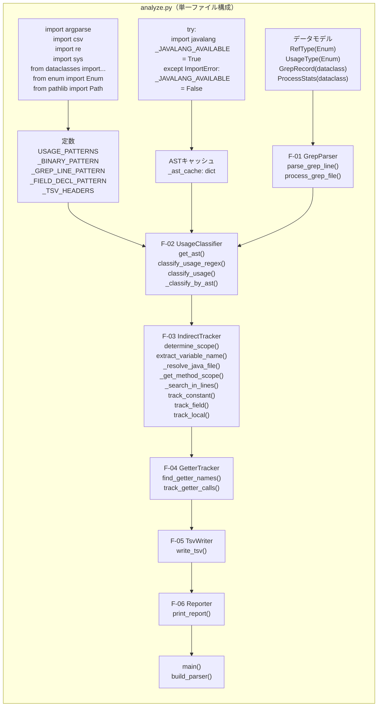

---

## 4. データモデル完全図

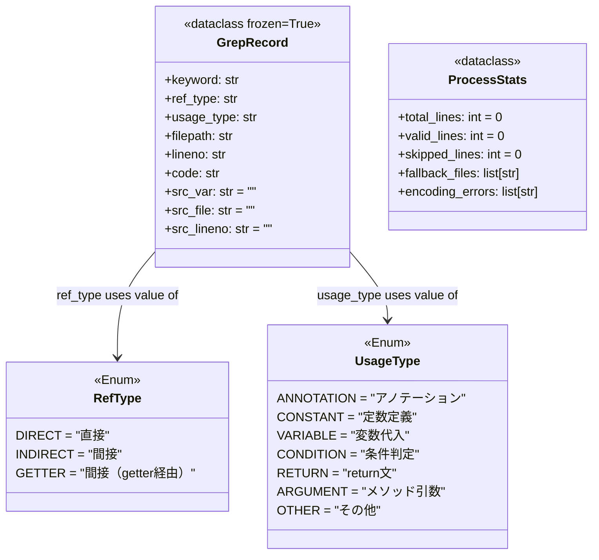

### GrepRecord の具体値イメージ

直接参照（`src_*` は空）：

| フィールド | 値の例 |
|---|---|
| `keyword` | `"SAMPLE"` |
| `ref_type` | `"直接"` |
| `usage_type` | `"定数定義"` |
| `filepath` | `"tests/fixtures/java/Constants.java"` |
| `lineno` | `"9"` |
| `code` | `'public static final String SAMPLE_CODE = "SAMPLE";'` |
| `src_var` | `""` |
| `src_file` | `""` |
| `src_lineno` | `""` |

間接参照（SAMPLE_CODE 経由）：

| フィールド | 値の例 |
|---|---|
| `keyword` | `"SAMPLE"` |
| `ref_type` | `"間接"` |
| `usage_type` | `"条件判定"` |
| `filepath` | `"tests/fixtures/java/Constants.java"` |
| `lineno` | `"13"` |
| `code` | `"if (value.equals(SAMPLE_CODE)) {"` |
| `src_var` | `"SAMPLE_CODE"` ← 経由した変数名 |
| `src_file` | `"tests/fixtures/java/Constants.java"` ← 変数の定義元 |
| `src_lineno` | `"9"` ← 定義元の行 |

---

## 5. 処理フロー全体シーケンス

```mermaid
sequenceDiagram
    participant CLI as main()
    participant GP as GrepParser
    participant UC as UsageClassifier
    participant AST as ASTCache
    participant IT as IndirectTracker
    participant GT as GetterTracker
    participant TW as TsvWriter

    CLI->>CLI: build_parser() → args解析
    CLI->>CLI: source_dir / input_dir / output_dir を検証
    CLI->>CLI: input/*.grep ファイル一覧を取得

    loop 各 .grep ファイル
        CLI->>GP: process_grep_file(path, keyword, source_dir)
        
        loop 各行
            GP->>GP: parse_grep_line(line)
            Note right of GP: :数字: で分割<br/>→ {filepath, lineno, code}
            GP->>UC: classify_usage(code, filepath, lineno)
            UC->>AST: get_ast(filepath, source_dir)
            
            alt ASTキャッシュにあり
                AST-->>UC: キャッシュされたtree（またはNone）
            else 初回
                AST->>AST: Javaファイルを読み込み
                AST->>AST: javalang.parse.parse(source)
                AST-->>UC: CompilationUnit tree
            end
            
            alt tree != None
                UC->>UC: _classify_by_ast(tree, lineno)
                Note right of UC: 全ノードを走査して<br/>position.line==linenoの<br/>ノード型を確認
            else tree == None
                UC->>UC: classify_usage_regex(code)
                Note right of UC: 正規表現パターンを<br/>優先度順に評価
            end
            
            UC-->>GP: usage_type 文字列
            GP->>GP: GrepRecord(直接参照) を生成
        end
        
        GP-->>CLI: direct_records: list[GrepRecord]

        loop 各 direct_record（定数定義・変数代入のみ）
            CLI->>IT: extract_variable_name(code, usage_type)
            IT-->>CLI: var_name（例: "SAMPLE_CODE"）
            
            CLI->>IT: determine_scope(usage_type, code, filepath, lineno)
            Note right of IT: AST で FieldDeclaration か<br/>LocalVariableDeclaration か判別
            IT-->>CLI: scope = "project" / "class" / "method"
            
            alt scope == "project"（static final 定数）
                CLI->>IT: track_constant(var_name, source_dir, origin)
                IT->>IT: 全 .java ファイルを rglob で列挙
                loop 各 .java ファイル
                    IT->>UC: classify_usage() で各ヒット行を分類
                    IT->>IT: _search_in_lines() で \bvar_name\b 検索
                end
                IT-->>CLI: indirect_records
                
            else scope == "class"（フィールド）
                CLI->>IT: track_field(var_name, class_file, origin)
                IT->>IT: 同一クラスファイル内を _search_in_lines() で検索
                IT-->>CLI: indirect_records
                
                CLI->>GT: find_getter_names(var_name, class_file)
                GT->>GT: 命名規則: "get" + var_name先頭大文字化
                GT->>AST: get_ast(class_file)
                GT->>GT: ReturnStatement で return var_name; を探す
                GT-->>CLI: getter_names: list[str]
                
                loop 各 getter_name
                    CLI->>GT: track_getter_calls(getter_name, source_dir, origin)
                    GT->>GT: 全 .java で \bgetter_name\s*\( 検索
                    GT-->>CLI: getter_records
                end
                
            else scope == "method"（ローカル変数）
                CLI->>IT: _get_method_scope(filepath, source_dir, lineno)
                IT->>AST: tree.filter(MethodDeclaration) でメソッド開始行収集
                IT->>IT: ブレースカウンタで終了行を特定
                IT-->>CLI: method_scope = (start, end)
                CLI->>IT: track_local(var_name, method_scope, origin)
                IT-->>CLI: indirect_records
            end
        end

        CLI->>TW: write_tsv(all_records, output_path)
        TW->>TW: レコードをソート（keyword → filepath → lineno数値）
        TW->>TW: UTF-8 BOM付きTSVに書き出し
    end

    CLI->>CLI: print_report(stats, processed_files)
```

---

## 6. 構文木（AST）完全ガイド

### 6-1. 構文木とは何か（概念）

**構文木（Abstract Syntax Tree / AST）** とは、ソースコードを「文字列の羅列」ではなく「**プログラムの構造**」として表現したツリー型のデータ構造です。

```
ソースコード（文字列）:
  "if (value.equals(SAMPLE_CODE)) { return true; }"

        ↓ パーサーが解析

構文木（ツリー構造）:
  IfStatement
  └── condition: MethodInvocation
  │     ├── qualifier: "value"
  │     ├── member: "equals"
  │     └── arguments: [MemberReference(member="SAMPLE_CODE")]
  └── then_statement: BlockStatement
        └── ReturnStatement
              └── expression: Literal(value="true")
```

**なぜ正規表現ではなく構文木が必要か？**

```java
// ケース1: パッケージプライベートフィールド（修飾子なし）
String type = "SAMPLE";
// → 正規表現: private/public 等がないため「ローカル変数」と誤判定
// → AST: FieldDeclaration ノードとして正確に判定

// ケース2: アノテーション内の定数
@Column(name = "SAMPLE")
// → 正規表現: = があるので「変数代入」と誤判定の可能性
// → AST: Annotation ノードとして正確に判定

// ケース3: 複雑な三項演算子
String x = condition ? "SAMPLE" : other;
// → AST でも1行に複数ノードがあると位置情報に依存した判定が難しい
```

---

### 6-2. インプット：Javaソースファイルの全文テキスト

`get_ast()` が受け取るインプットは **Javaソースファイルの全文テキスト（1つのファイル丸ごと）** です。

```
インプット: src/com/example/Constants.java の全文
─────────────────────────────────────────────────────
package com.example;

/**
 * 統合テスト用サンプル: 直接参照・定数定義パターン
 */
public class Constants {

    /** 検索対象の定数 */
    public static final String SAMPLE_CODE = "SAMPLE";     ← 9行目

    /** 条件判定での使用 */
    public static boolean isSample(String value) {         ← 12行目
        if (value.equals(SAMPLE_CODE)) {                   ← 13行目
            return true;                                   ← 14行目
        }
        return false;                                      ← 16行目
    }

    /** return文での使用 */
    public static String getSampleCode() {                 ← 20行目
        return SAMPLE_CODE;                                ← 21行目
    }
}
─────────────────────────────────────────────────────

処理: javalang.parse.parse(テキスト全体)

アウトプット: CompilationUnit（構文木のルートノード）
```

---

### 6-3. javalang が生成する構文木の全量

`Constants.java` に対して生成される構文木の **全量** を可視化します。

```mermaid
graph TD
    ROOT["CompilationUnit<br/>─────────────────<br/>package: com.example"]

    ROOT --> TYPE["ClassDeclaration<br/>─────────────────<br/>name: 'Constants'<br/>modifiers: {'public'}<br/>position: line=6"]

    TYPE --> FIELD["FieldDeclaration<br/>─────────────────<br/>modifiers: {'public','static','final'}<br/>type: ReferenceType('String')<br/>position: line=9"]

    TYPE --> METHOD1["MethodDeclaration<br/>─────────────────<br/>name: 'isSample'<br/>modifiers: {'public','static'}<br/>return_type: boolean<br/>position: line=12"]

    TYPE --> METHOD2["MethodDeclaration<br/>─────────────────<br/>name: 'getSampleCode'<br/>modifiers: {'public','static'}<br/>return_type: String<br/>position: line=20"]

    FIELD --> VARDECL["VariableDeclarator<br/>─────────────────<br/>name: 'SAMPLE_CODE'"]
    VARDECL --> LIT1["Literal<br/>─────<br/>value: '\"SAMPLE\"'"]

    METHOD1 --> PARAM["FormalParameter<br/>─────────────────<br/>type: String<br/>name: 'value'"]
    METHOD1 --> IF["IfStatement<br/>─────────────────<br/>position: line=13"]

    IF --> COND["MethodInvocation<br/>─────────────────<br/>qualifier: 'value'<br/>member: 'equals'<br/>position: line=13"]
    COND --> ARG1["MemberReference<br/>─────────────────<br/>member: 'SAMPLE_CODE'"]

    IF --> THEN["BlockStatement"]
    THEN --> RET1["ReturnStatement<br/>─────────────────<br/>position: line=14"]
    RET1 --> LIT2["Literal<br/>─────<br/>value: 'true'"]

    METHOD1 --> RET2["ReturnStatement<br/>─────────────────<br/>position: line=16"]
    RET2 --> LIT3["Literal<br/>─────<br/>value: 'false'"]

    METHOD2 --> RET3["ReturnStatement<br/>─────────────────<br/>position: line=21"]
    RET3 --> MEMREF["MemberReference<br/>─────────────────<br/>member: 'SAMPLE_CODE'"]

    style ROOT fill:#f0f8ff,stroke:#4682b4
    style FIELD fill:#fff3e0,stroke:#ff9800
    style IF fill:#fce4ec,stroke:#e91e63
    style RET1 fill:#e8f5e9,stroke:#4caf50
    style RET2 fill:#e8f5e9,stroke:#4caf50
    style RET3 fill:#e8f5e9,stroke:#4caf50
    style METHOD1 fill:#f3e5f5,stroke:#9c27b0
    style METHOD2 fill:#f3e5f5,stroke:#9c27b0
```

`Entity.java` の構文木：

```mermaid
graph TD
    ROOT2["CompilationUnit<br/>package: com.example"]
    ROOT2 --> CLS2["ClassDeclaration<br/>name: 'Entity'<br/>modifiers: {'public'}"]
    CLS2 --> FLD2["FieldDeclaration<br/>─────────────────<br/>modifiers: {'private'}<br/>type: String<br/>position: line=8"]
    CLS2 --> MTH2["MethodDeclaration<br/>─────────────────<br/>name: 'getType'<br/>modifiers: {'public'}<br/>return_type: String<br/>position: line=10"]

    FLD2 --> VD2["VariableDeclarator<br/>name: 'type'"]
    VD2 --> LT2["Literal<br/>value: '\"SAMPLE\"'"]

    MTH2 --> RT2["ReturnStatement<br/>position: line=11"]
    RT2 --> MR2["MemberReference<br/>member: 'type'"]

    style FLD2 fill:#fff3e0,stroke:#ff9800
    style RT2 fill:#e8f5e9,stroke:#4caf50
```

---

### 6-4. 構文木を走査して「何を探しているか」

`javalang` の構文木は **深さ優先でイテレート** できます。

```python
for _, node in tree:
    # nodeにはCompilationUnitの全ノードが順番に来る
    # (ClassDeclaration, FieldDeclaration, VariableDeclarator, Literal, ...)
```

`Constants.java` の構文木を深さ優先で走査すると、以下の順番でノードが出てきます：

```
走査順（概略）:
 1. CompilationUnit            ← position = None
 2. ClassDeclaration           ← position.line = 6
 3. FieldDeclaration           ← position.line = 9  ★ 9行目を探すとここ
 4. ReferenceType              ← position = None
 5. VariableDeclarator         ← position.line = 9
 6. Literal("SAMPLE")          ← position.line = 9
 7. MethodDeclaration(isSample)← position.line = 12
 8. BasicType(boolean)         ← position = None
 9. FormalParameter(value)     ← position.line = 12
10. IfStatement                ← position.line = 13 ★ 13行目を探すとここ
11. MethodInvocation(equals)   ← position.line = 13
12. MemberReference(SAMPLE_CODE)← position.line = 13
13. ReturnStatement(true)      ← position.line = 14
14. Literal(true)              ← position.line = 14
15. ReturnStatement(false)     ← position.line = 16
16. Literal(false)             ← position.line = 16
17. MethodDeclaration(getSampleCode)← position.line = 20
18. ReturnStatement(SAMPLE_CODE)← position.line = 21
19. MemberReference(SAMPLE_CODE)← position.line = 21
```

**`_classify_by_ast(tree, lineno=9)` が実際に行うこと：**

```
走査ステップ1: CompilationUnit → position=None → スキップ
走査ステップ2: ClassDeclaration → position.line=6 ≠ 9 → スキップ
走査ステップ3: FieldDeclaration → position.line=9 == 9 → ★ヒット！
  isinstance(node, FieldDeclaration) → True
  modifiers = {"public", "static", "final"}
  "static" in modifiers AND "final" in modifiers → True
  → return "定数定義"  ← ここで即座に return（残りは走査しない）
```

**`_classify_by_ast(tree, lineno=13)` が実際に行うこと：**

```
走査ステップ1: CompilationUnit → None → スキップ
走査ステップ2: ClassDeclaration → line=6 ≠ 13 → スキップ
走査ステップ3: FieldDeclaration → line=9 ≠ 13 → スキップ
走査ステップ4: ReferenceType → None → スキップ
走査ステップ5: VariableDeclarator → line=9 ≠ 13 → スキップ
走査ステップ6: Literal("SAMPLE") → line=9 ≠ 13 → スキップ
走査ステップ7: MethodDeclaration → line=12 ≠ 13 → スキップ
走査ステップ8: BasicType → None → スキップ
走査ステップ9: FormalParameter → line=12 ≠ 13 → スキップ
走査ステップ10: IfStatement → line=13 == 13 → ★ヒット！
  isinstance(node, IfStatement) → True
  → return "条件判定"
```

---

### 6-5. 各ノード型と判定ロジックの対応

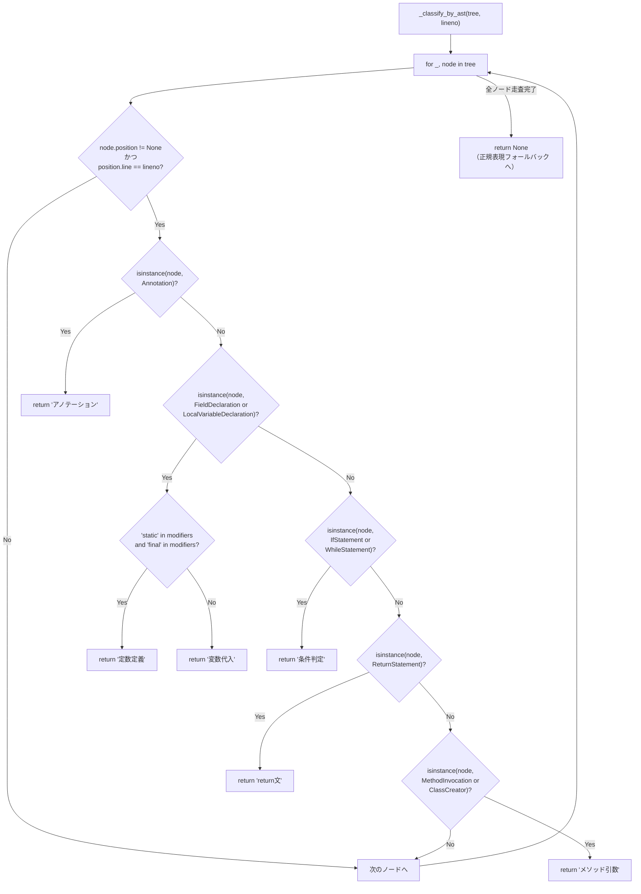

**判定対象ノード一覧（javalang.tree の型）**

| ASTノード型 | 対応するJavaコード例 | 判定結果 |
|---|---|---|
| `Annotation` | `@RequestMapping("SAMPLE")` | アノテーション |
| `FieldDeclaration` + `static final` | `public static final String CODE = "SAMPLE"` | 定数定義 |
| `FieldDeclaration` | `private String type = "SAMPLE"` | 変数代入 |
| `LocalVariableDeclaration` | `String msg = "SAMPLE"` | 変数代入 |
| `IfStatement` | `if (x.equals("SAMPLE"))` | 条件判定 |
| `WhileStatement` | `while (code.equals("SAMPLE"))` | 条件判定 |
| `ReturnStatement` | `return "SAMPLE"` | return文 |
| `MethodInvocation` | `log.info("SAMPLE")` | メソッド引数 |
| `ClassCreator` | `new Obj("SAMPLE")` | メソッド引数 |

**判定されないノード（positionを持たないか、対象外）**

| ASTノード型 | 理由 |
|---|---|
| `CompilationUnit` | `position = None` |
| `TypeDeclaration` | 対象判定ロジックにない |
| `ReferenceType` | `position = None` |
| `MemberReference` | 対象判定ロジックにない |
| `Literal` | 対象判定ロジックにない |

> **重要**: 1行に複数のノードが存在する場合（例：`if` 文の中に `MethodInvocation` がある行）、
> 走査順で**最初にヒットしたノード**の型で判定される。
> javalang は外側（`IfStatement`）→ 内側（`MethodInvocation`）の順で走査するため、
> `IfStatement` が先に返ってくる → 「条件判定」と判定される。

---

## 7. F-01 GrepParser：入力解析

### parse_grep_line の詳細フロー

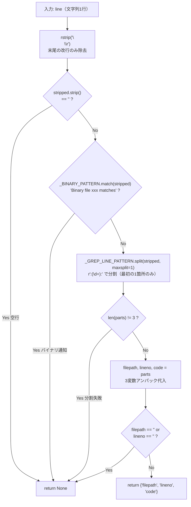

### Windows パス対応の仕組み

```
問題: Windowsパスは "C:\path\file.java:42:code" の形式

単純な split(":", 2) では:
  ["C", "\\path\\file.java", "42:code"]
           ↑ここで誤分割

re.split(r':(\d+):', line, maxsplit=1) では:
  "C:\\path\\file.java"  "42"  "code"
   ←ファイルパス→        ←行→  ←コード→
  
理由: ":42:" という「コロン+数字列+コロン」のパターンだけが区切り文字になる
     "C:" の "C" は数字でないため区切りにならない
     maxsplit=1 で最初の1箇所だけ分割（コード内の "a:b" を誤分割しない）
```

---

## 8. F-02 UsageClassifier：使用タイプ分類

### 2段階判定の全フロー

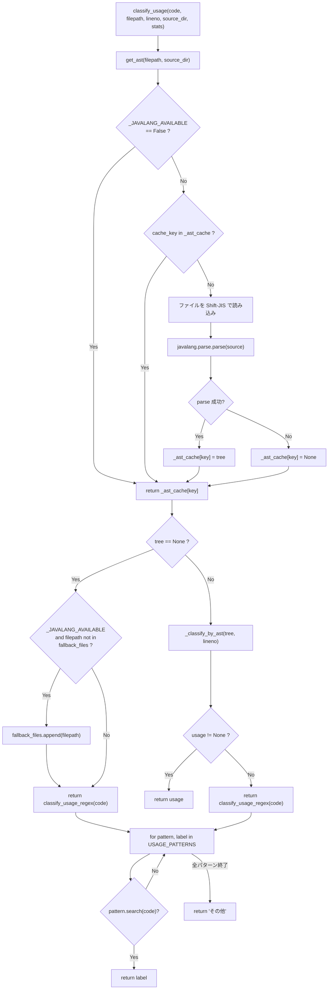

### 正規表現フォールバックのパターンと優先度

```
USAGE_PATTERNS = [
  優先度1: r'@\w+\s*\('           → "アノテーション"
  優先度2: r'\bstatic\s+final\b'  → "定数定義"
  優先度3: r'\bif\s*\(|\bwhile\s*\(|\.equals\s*\(|[!=]='  → "条件判定"
  優先度4: r'\breturn\b'          → "return文"
  優先度5: r'\b\w[\w<>\[\]]*\s+\w+\s*='  → "変数代入"
  優先度6: r'\w+\s*\('            → "メソッド引数"
  （全不一致）                    → "その他"
]
```

**優先度設計の意図を理解するための具体例**

```
入力: "return a.equals(CODE);"

マッチするパターン:
  優先度3: \.equals\s*\( → マッチ ✓
  優先度4: \breturn\b    → マッチ ✓

優先度3が先に評価されるため → "条件判定"

設計意図: return の中で equals していても
「比較している」という本質的な意味を優先する
```

```
入力: "public static final String CODE = \"SAMPLE\";"

マッチするパターン:
  優先度2: \bstatic\s+final\b → マッチ ✓
  優先度5: \b\w[\w<>..]*\s+\w+\s*=  → マッチ ✓

優先度2が先のため → "定数定義"（"変数代入" にはならない）
```

---

## 9. F-03 IndirectTracker：間接参照追跡

### スコープ決定フロー

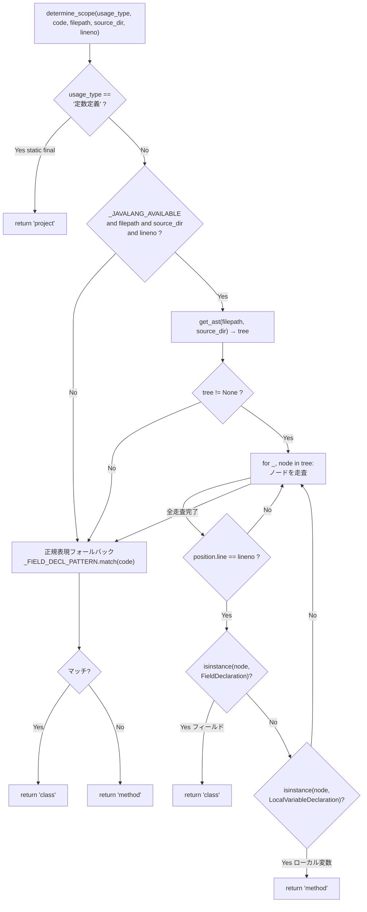

**3つのスコープと追跡範囲の違い**

| スコープ | 変数の種類 | 例 | 追跡先 |
|---|---|---|---|
| `project` | static final 定数 | `public static final String CODE = "SAMPLE"` | `source_dir` 以下の全 `.java` ファイル |
| `class` | インスタンスフィールド | `private String type = "SAMPLE"` | 同一クラスファイルのみ |
| `method` | ローカル変数 | `String msg = "SAMPLE"` | 同一メソッドの行範囲内 |

### _search_in_lines の動作原理

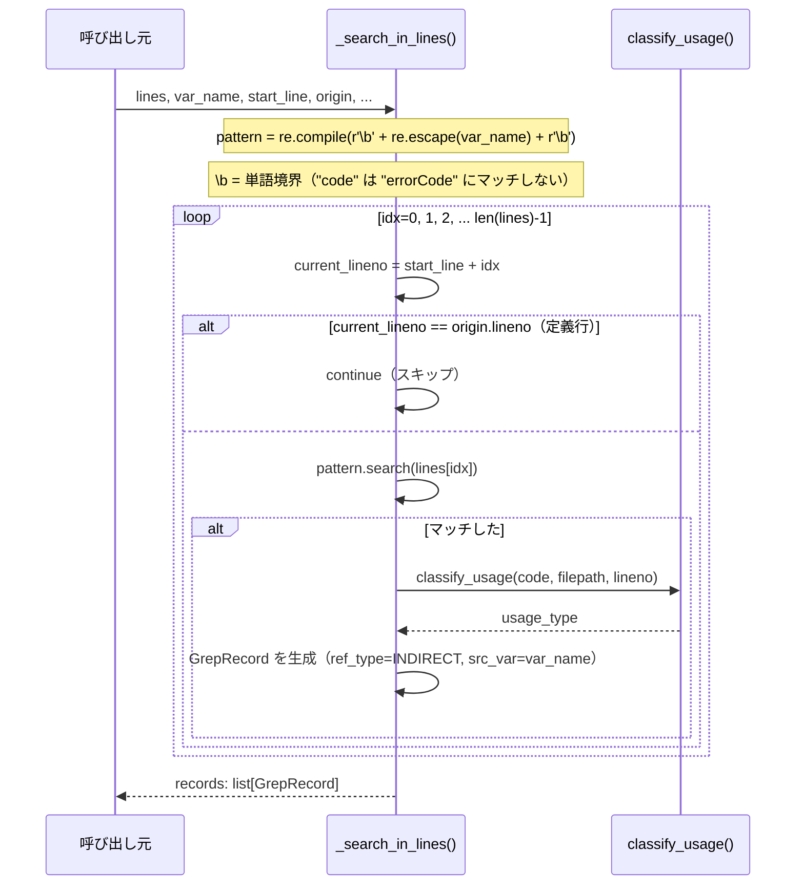

### _get_method_scope のブレースカウンタ詳細

```java
// method_start = 12 として走査開始
12: public static boolean isSample(String value) {
13:     if (value.equals(SAMPLE_CODE)) {
14:         return true;
15:     }
16:     return false;
17: }
```

```
i=12: line = "public static boolean isSample(String value) {"
      '{' の個数: 1  '}' の個数: 0  → brace_count = 0 + 1 - 0 = 1
      found_open = False → brace_count > 0 → found_open = True
      found_open=True かつ brace_count=1 > 0 → 終了条件を満たさない

i=13: line = "    if (value.equals(SAMPLE_CODE)) {"
      '{' の個数: 1  '}' の個数: 0  → brace_count = 1 + 1 - 0 = 2
      found_open=True かつ brace_count=2 > 0 → 終了しない

i=14: line = "        return true;"
      '{' の個数: 0  '}' の個数: 0  → brace_count = 2 + 0 - 0 = 2
      終了しない

i=15: line = "    }"
      '{' の個数: 0  '}' の個数: 1  → brace_count = 2 + 0 - 1 = 1
      終了しない

i=16: line = "    return false;"
      '{' の個数: 0  '}' の個数: 0  → brace_count = 1 + 0 - 0 = 1
      終了しない

i=17: line = "}"
      '{' の個数: 0  '}' の個数: 1  → brace_count = 1 + 0 - 1 = 0
      found_open=True かつ brace_count=0 <= 0 → ★終了条件成立！
      → return (12, 17)
```

**`found_open` フラグが必要な理由の具体例**：

```java
// クラス宣言の '}' が先にある場合（なぜか）
// 実際はないが、仮に method_start=10 からカウントを始めたとき
// メソッドより前のクラス宣言 '{' 内の '}' が積み重なっていると
// found_open なしだと誤検出が起きる

// found_open があることで「最初の { を見た後から終了判定を始める」が保証される
```

---

## 10. F-04 GetterTracker：getter経由追跡

### getter名検出の2方式

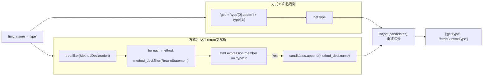

**Entity.java での具体的な動作**

```java
public class Entity {
    private String type = "SAMPLE";  // field_name = "type"

    public String getType() {        // ← 方式1（getType）AND 方式2（return type;）
        return type;
    }

    public String fetchCurrentType() {  // ← 方式2のみ（非標準命名）
        return type;
    }
}
```

```
方式2 の AST 走査詳細:
  tree.filter(MethodDeclaration) → [getType, fetchCurrentType]
  
  getType:
    method_decl.filter(ReturnStatement) → [return type;]
    stmt.expression → MemberReference(member="type")
    stmt.expression.member == "type" → True
    candidates.append("getType")
    
  fetchCurrentType:
    method_decl.filter(ReturnStatement) → [return type;]
    stmt.expression.member == "type" → True
    candidates.append("fetchCurrentType")

candidates = ["getType", "getType", "fetchCurrentType"]
set(candidates) = {"getType", "fetchCurrentType"}
list(...) = ["getType", "fetchCurrentType"]（順序不定）
```

### track_getter_calls の検索パターン

```python
# getter_name = "getType" のとき
pattern = re.compile(r'\bgetType\s*\(')
# \b     : 単語境界（"myGetType(" にマッチしない）
# \s*    : メソッド名と ( の間のスペースに対応
#         （通常は "getType(" だが念のため "getType (" にも対応）
```

---

## 11. F-05 TsvWriter：TSV出力

### ソートキーの仕組み

```python
sorted_records = sorted(
    records,
    key=lambda r: (r.keyword, r.filepath, int(r.lineno) if r.lineno.isdigit() else 0),
)
```

```
ソート例（複合キー）:
  record A: keyword="FOO", filepath="A.java", lineno="10"
  record B: keyword="BAR", filepath="B.java", lineno="2"
  record C: keyword="FOO", filepath="A.java", lineno="2"
  record D: keyword="FOO", filepath="B.java", lineno="1"

ソートキー:
  A: ("FOO", "A.java", 10)
  B: ("BAR", "B.java", 2)
  C: ("FOO", "A.java", 2)
  D: ("FOO", "B.java", 1)

ソート結果:
  B → ("BAR", "B.java", 2)
  C → ("FOO", "A.java", 2)
  A → ("FOO", "A.java", 10)
  D → ("FOO", "B.java", 1)
```

**文字列ソートと数値ソートの危険**

```
lineno が str のまま比較すると:
  ["1", "10", "2", "21", "9"]  ← 辞書順（間違い）

int() 変換後:
  [1, 2, 9, 10, 21]           ← 数値順（正しい）
```

### TSVヘッダー列

```
文言 | 参照種別 | 使用タイプ | ファイルパス | 行番号 | コード行 | 参照元変数名 | 参照元ファイル | 参照元行番号
```

**encoding="utf-8-sig" の意味**

```
"utf-8-sig" = UTF-8 + BOM（Byte Order Mark）

ファイルの先頭に 3バイト: EF BB BF が付く

必要な理由:
  Windows の Excel は BOM なし UTF-8 を "ANSI" と誤認識して文字化けする
  BOM があると Excel が正しく UTF-8 と認識する

newline="" の理由:
  csv モジュールが自前で改行を管理する
  newline="" なしだと Python の改行変換 + csv の改行変換で \r\r\n になる
```

---

## 12. F-06 Reporter：サマリ表示

```
--- 処理完了 ---
処理ファイル: SAMPLE.grep
総行数: 5  有効: 4  スキップ: 1
ASTフォールバック (1 件):
  BadSyntax.java
エンコーディングエラー (0 件):
```

| 項目 | 説明 |
|---|---|
| `total_lines` | grepファイルの全行数 |
| `valid_lines` | GrepRecord が生成された行数 |
| `skipped_lines` | 空行・バイナリ通知・パース失敗行 |
| `fallback_files` | ASTパースに失敗し正規表現で代替したファイル |
| `encoding_errors` | `read_text()` で例外が発生したファイル |

---

## 13. ASTキャッシュ機構の詳細

### キャッシュの状態遷移

```mermaid
stateDiagram-v2
    [*] --> 未登録: プロセス起動時

    未登録 --> パース試行: cache_key not in _ast_cache

    パース試行 --> 成功: javalang.parse.parse() 完了
    パース試行 --> 失敗: Exception 発生
    パース試行 --> 失敗: ファイルが存在しない

    成功: _ast_cache[key] = CompilationUnit tree
    失敗: _ast_cache[key] = None

    成功 --> キャッシュ済み
    失敗 --> キャッシュ済み

    キャッシュ済み --> キャッシュ済み: 次回は即 return _ast_cache[key]

    note right of キャッシュ済み
        dict の in 演算子で存在チェック
        get() は使わない（None と未登録を区別するため）
    end note
```

### なぜ `in` 演算子を使って `get()` を使わないか

```python
cache = {"Bad.java": None}  # パース失敗をキャッシュ済み

# NG: get() では区別できない
cache.get("Bad.java")  # → None  （キャッシュ済み・パース失敗）
cache.get("New.java")  # → None  （まだ試みていない）
# どちらも None → 毎回パースを試みてしまう（無駄な I/O）

# OK: in で区別する
"Bad.java" in cache  # → True  → スキップ（パース失敗はもうわかってる）
"New.java" in cache  # → False → 初めてパースを試みる
```

---

## 14. 正規表現フォールバックの仕組み

### なぜ正規表現が「フォールバック」なのか

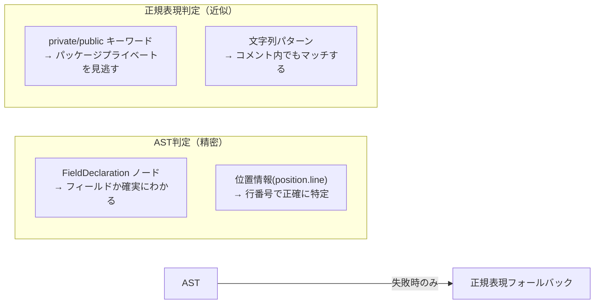

**正規表現が誤判定するケース一覧**

```java
// ケース1: パッケージプライベートフィールド（修飾子なし）
String type = "SAMPLE";
// 正規表現: _FIELD_DECL_PATTERN は private/public を期待 → ローカル変数と誤判定
// AST: FieldDeclaration ノード → "class"スコープと正確に判定

// ケース2: ジェネリクス型のローカル変数
List<String> codes = new ArrayList<>();
codes.add("SAMPLE");
// 正規表現: r'\b\w[\w<>\[\]]*\s+\w+\s*=' にマッチ → "変数代入" ← 正しい偶然の一致
// AST: LocalVariableDeclaration → "変数代入" ← 正確

// ケース3: コメント内の "return"
// return "SAMPLE"; ← コメントアウトされた行
// 正規表現: \breturn\b にマッチ → "return文" と誤判定
// AST: position.line でその行を見ても実際の文はない → None → 正規表現へ（誤判定）
```

---

## 15. スコープ判定の全パターン

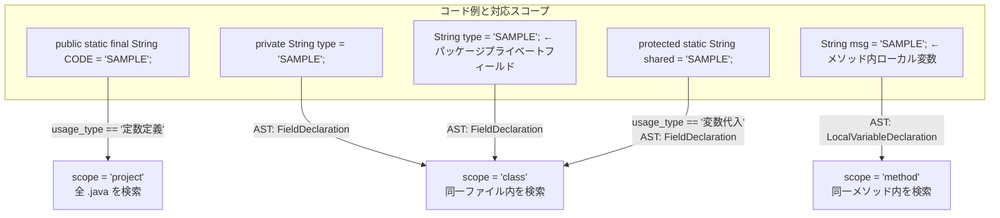

---

## 16. エラーハンドリング設計

```mermaid
flowchart TD
    ERR1["javalang が未インストール"]
    ERR2["Javaファイルが存在しない"]
    ERR3["Javaの構文エラー\n（javalang がパース失敗）"]
    ERR4["ファイル読み込みエラー\n（エンコーディング例外）"]
    ERR5["grep ファイルの不正行\n（形式違反・空行・バイナリ通知）"]

    ERR1 -->|_JAVALANG_AVAILABLE = False| FB1["全ファイルで正規表現フォールバック"]
    ERR2 -->|_ast_cache[key] = None| FB2["正規表現フォールバック\n（fallback_files には追加しない）"]
    ERR3 -->|_ast_cache[key] = None| FB3["正規表現フォールバック\nfallback_files に記録"]
    ERR4 -->|errors='replace'| FB4["化け字で継続\n（critical でないため処理続行）"]
    ERR5 -->|parse_grep_line → None| FB5["その行をスキップ\nskipped_lines をインクリメント"]

    subgraph "致命的エラー（sys.exit）"
        FE1["source_dir が存在しない → exit(1)"]
        FE2["grep ファイルが0件 → exit(1)"]
        FE3["予期しない例外（最外層 try-except） → exit(2)"]
    end
```

---

## 17. テストフィクスチャで動作を追う完全トレース

### 使用するファイル

```
input/SAMPLE.grep の内容:
─────────────────────────────────────────
tests/fixtures/java/Constants.java:9:    public static final String SAMPLE_CODE = "SAMPLE";
tests/fixtures/java/Constants.java:13:        if (value.equals(SAMPLE_CODE)) {
tests/fixtures/java/Entity.java:8:    private String type = "SAMPLE";
─────────────────────────────────────────
```

### 完全な処理トレース

#### ステップ1: grepファイルの行パース

```
行1: "tests/fixtures/java/Constants.java:9:    public static final String SAMPLE_CODE = \"SAMPLE\";"

parse_grep_line:
  stripped = "tests/fixtures/java/Constants.java:9:    public static final ..."
  _BINARY_PATTERN.match → No
  _GREP_LINE_PATTERN.split(":9:") → 3分割
  filepath = "tests/fixtures/java/Constants.java"
  lineno   = "9"
  code     = 'public static final String SAMPLE_CODE = "SAMPLE";'
  → {"filepath": "tests/...", "lineno": "9", "code": "..."}
```

#### ステップ2: 使用タイプ分類（Constants.java 行9）

```
classify_usage(code, "tests/.../Constants.java", lineno=9, source_dir)

  get_ast("tests/.../Constants.java", source_dir):
    _ast_cache 未登録 → ファイルを Shift-JIS で読み込み
    javalang.parse.parse(source) → CompilationUnit tree
    _ast_cache["tests/.../Constants.java"] = tree

  _classify_by_ast(tree, lineno=9):
    node#1: CompilationUnit → position=None → スキップ
    node#2: ClassDeclaration → position.line=6 ≠ 9 → スキップ
    node#3: FieldDeclaration → position.line=9 == 9 → ヒット！
      modifiers = {"public", "static", "final"}
      "static" in modifiers AND "final" in modifiers → True
      → return "定数定義"

  → usage_type = "定数定義"

→ GrepRecord(
    keyword="SAMPLE", ref_type="直接", usage_type="定数定義",
    filepath="tests/.../Constants.java", lineno="9",
    code='public static final String SAMPLE_CODE = "SAMPLE";',
    src_var="", src_file="", src_lineno=""
  )
```

#### ステップ3: 使用タイプ分類（Constants.java 行13）

```
classify_usage(code, "tests/.../Constants.java", lineno=13, source_dir)

  get_ast("tests/.../Constants.java", source_dir):
    _ast_cache にあり → キャッシュから即返す（I/O なし）

  _classify_by_ast(tree, lineno=13):
    ...（行9までのノードはすべて line≠13 でスキップ）
    node#10: IfStatement → position.line=13 == 13 → ヒット！
      isinstance(node, IfStatement) → True
      → return "条件判定"

  → usage_type = "条件判定"
```

#### ステップ4: 間接参照追跡（SAMPLE_CODE の定義行から）

```
直接参照レコード（定数定義）を起点に間接追跡:

  extract_variable_name('public static final String SAMPLE_CODE = "SAMPLE";', "定数定義")
    rstrip(';') → 'public static final String SAMPLE_CODE = "SAMPLE"'
    split('=')[0].strip() → "public static final String SAMPLE_CODE"
    split() → ["public", "static", "final", "String", "SAMPLE_CODE"]
    tokens[-1] = "SAMPLE_CODE"
    isidentifier("SAMPLE_CODE") → True
    → "SAMPLE_CODE"

  determine_scope("定数定義", ...)
    usage_type == "定数定義" → True
    → scope = "project"

  track_constant("SAMPLE_CODE", source_dir, origin, stats):
    source_dir.rglob("*.java") → [Constants.java, Entity.java, Service.java, ...]
    
    Constants.java 全行:
      行1:  "package com.example;"
            pattern = \bSAMPLE_CODE\b
            マッチなし
      ...
      行9:  'public static final String SAMPLE_CODE = "SAMPLE";'
            マッチするが current_lineno=9 == origin.lineno="9" → スキップ（定義行）
      ...
      行13: "if (value.equals(SAMPLE_CODE)) {"
            \bSAMPLE_CODE\b にマッチ！
            classify_usage(code, filepath, 13) → "条件判定"
            → GrepRecord(
                keyword="SAMPLE", ref_type="間接", usage_type="条件判定",
                filepath="Constants.java", lineno="13",
                code="if (value.equals(SAMPLE_CODE)) {",
                src_var="SAMPLE_CODE",
                src_file="tests/.../Constants.java",
                src_lineno="9"
              )
      行21: "return SAMPLE_CODE;"
            マッチ！
            classify_usage → "return文"
            → GrepRecord(間接, return文, lineno="21", src_var="SAMPLE_CODE", ...)

    Service.java 全行:
      行18: "return Constants.SAMPLE_CODE.equals(code);"
            マッチ！ → GrepRecord(間接, ...)
```

#### ステップ5: Entity.java のフィールド追跡 + getter追跡

```
直接参照レコード（変数代入）を起点に:
  code: "private String type = \"SAMPLE\";"
  
  extract_variable_name → "type"
  determine_scope("変数代入", code, "Entity.java", source_dir, lineno=8)
    AST で Entity.java の行8を確認
    FieldDeclaration → scope = "class"

  track_field("type", Entity.java, origin, source_dir, stats):
    Entity.java 全行を _search_in_lines():
      行8: "private String type = \"SAMPLE\";" → 定義行スキップ
      行11: "return type;" → \btype\b にマッチ！
            classify_usage → "return文"
            → GrepRecord(間接, return文, ...)

  find_getter_names("type", Entity.java):
    方式1: "get" + "T" + "ype" = "getType"
    方式2 (AST):
      MethodDeclaration "getType":
        ReturnStatement: stmt.expression.member = "type" == "type" → "getType" 追加
      → candidates = ["getType", "getType"]
      → set → {"getType"}
      → ["getType"]

  track_getter_calls("getType", source_dir, origin, stats):
    pattern = r'\bgetType\s*\('
    全 .java ファイルを走査:
      Service.java 行10:
        "if (entity.getType().equals(\"SAMPLE\")) {"
        \bgetType\s*\( にマッチ！
        classify_usage → "条件判定"
        → GrepRecord(
            keyword="SAMPLE", ref_type="間接（getter経由）", usage_type="条件判定",
            filepath="Service.java", lineno="10",
            code='if (entity.getType().equals("SAMPLE")) {',
            src_var="getType",
            src_file="Entity.java",
            src_lineno="8"
          )
```

#### ステップ6: TSV出力

```
write_tsv(all_records, "output/SAMPLE.tsv")

ソート後の出力順（keyword="SAMPLE" 固定 → filepath → lineno数値順）:

行  filepath          lineno  ref_type          usage_type   code
──────────────────────────────────────────────────────────────────────
9   Constants.java    9       直接              定数定義      public static final String SAMPLE_CODE = "SAMPLE";
10  Constants.java    13      直接              条件判定      if (value.equals(SAMPLE_CODE)) {
11  Constants.java    13      間接              条件判定      if (value.equals(SAMPLE_CODE)) {  ←src_var=SAMPLE_CODE
12  Constants.java    21      間接              return文      return SAMPLE_CODE;
13  Entity.java       8       直接              変数代入      private String type = "SAMPLE";
14  Entity.java       11      間接              return文      return type;
15  Service.java      10      間接（getter経由）条件判定      if (entity.getType().equals("SAMPLE")) {
16  Service.java      18      間接              条件判定      return Constants.SAMPLE_CODE.equals(code);

※ 行番号はTSV内の行番号ではなくJavaソースの行番号
```

---

## まとめ：構文木に関するQ&A

### Q1. 構文木のインプットは何ですか？

**Javaソースファイル1ファイル分の全文テキスト**です。
`javalang.parse.parse(source_code_string)` に渡します。
ファイルは Shift-JIS で読み込まれます（古いJavaプロジェクト対応）。

### Q2. 構文木の「全量」はどうなっていますか？

ルートは `CompilationUnit`（コンパイル単位 = 1ファイル）で、以下のような階層になります：

```
CompilationUnit
└── ClassDeclaration
    ├── FieldDeclaration     ← フィールド（静的・インスタンス）
    │   └── VariableDeclarator
    │       └── Literal / MemberReference / ...（初期値）
    ├── MethodDeclaration    ← メソッド
    │   ├── FormalParameter  ← 引数
    │   ├── IfStatement      ← if 文
    │   │   ├── condition    ← 条件式
    │   │   └── then/else   ← ブロック
    │   ├── ReturnStatement  ← return 文
    │   ├── LocalVariableDeclaration ← ローカル変数
    │   └── MethodInvocation ← メソッド呼び出し
    └── ...
```

### Q3. 構文木の中から何を探しているのですか？

**「指定された行番号（`lineno`）に位置するノード」** を探し、
そのノードの型（`isinstance` で判定）によって使用タイプを決定します。

具体的には：
- その行が `FieldDeclaration` ノードか → フィールド（定数定義 or 変数代入）
- その行が `IfStatement` ノードか → 条件判定
- その行が `ReturnStatement` ノードか → return文
- その行が `MethodInvocation` ノードか → メソッド引数
- その行が `Annotation` ノードか → アノテーション

これを実現するため、`_classify_by_ast()` は **構文木全体を深さ優先で走査**し、
各ノードの `position.line` を目的の行番号と比較します。

### Q4. 構文木が使えないときはどうなりますか？

以下のいずれかの状況では正規表現フォールバックが使われます：
1. `javalang` が未インストール（`_JAVALANG_AVAILABLE = False`）
2. Javaファイルが存在しない
3. Javaの構文エラー（`javalang` がパースに失敗）
4. 構文木を走査したが対象行のノードが見つからなかった

正規表現フォールバックは精度が下がる（特にパッケージプライベートフィールドの誤判定）ため、
`ProcessStats.fallback_files` に記録してサマリで報告されます。
